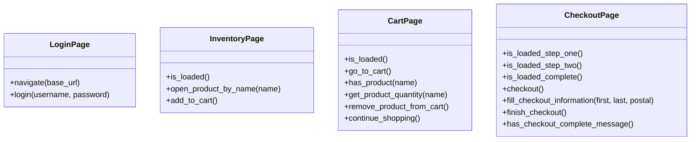

# Assessment 3 — Automation

## Overview

This project automates a user journey on [SauceDemo](https://www.saucedemo.com) and verifies that key buttons exist on the Cart page. It uses Python, Playwright, and pytest with the Page Object Model (POM) pattern. Tests are written in BDD style using **pytest-bdd** with Gherkin feature files.

## User Journey

```
Login -> Open Product A -> Add to Cart -> Back to Products -> Open Product B -> Add to Cart -> View Cart -> Checkout
```

### Flow Diagram

```mermaid
flowchart LR
    Login[Login Page] --> Inventory[Inventory Page]
    Inventory -->|Click product| ProductA[Product Detail]
    ProductA -->|Add to cart| Inventory2[Inventory Page]
    Inventory2 -->|Click product| ProductB[Product Detail]
    ProductB -->|Add to cart| Cart[Cart Page]
    Cart -->|Checkout| CheckoutStep1[Checkout Step 1]
    CheckoutStep1 -->|Fill info| CheckoutStep2[Checkout Step 2]
    CheckoutStep2 -->|Finish| Complete[Order Complete]
```



## Cart Page Assertions

After completing the journey the test verifies:

1. **Remove** button exists for each product in the cart
2. **Continue Shopping** button is visible
3. **Checkout** button is visible

## Architecture — Page Object Model

Each page of the application is represented by a Python class that encapsulates its locators and interactions.



| Page Object | File | Responsibility |
|---|---|---|
| `LoginPage` | `pages/login_page.py` | Navigate to login, fill credentials, submit |
| `InventoryPage` | `pages/product_inventory_page.py` | Product listing, open a product by name, add to cart |
| `CartPage` | `pages/cart_page.py` | Cart navigation, product verification, remove, continue shopping |
| `CheckoutPage` | `pages/checkout.py` | Checkout flow: fill info, finish, verify completion |

## BDD Layer — pytest-bdd

Tests use Gherkin feature files and Python step definitions following Cucumber conventions.

```
tests/
├── features/
│   ├── login.feature               # Login-only scenario
│   └── user_journey.feature        # Full user journey scenarios
├── step_defs/
│   └── test_user_journey_steps.py  # Given/When/Then step implementations
└── conftest.py                     # Shared fixtures (browser config)
```

### Feature Files

- `tests/features/login.feature` — standalone login verification scenario
- `tests/features/user_journey.feature` — full user journey scenarios with a shared `Background` block for login

### Step Definitions

`tests/step_defs/test_user_journey_steps.py` contains all step implementations. Steps use `target_fixture` to pass state (POM objects) between steps. Parameterised steps like `the user opens the '{product_name}' product` use `parsers.parse` for type conversion.

## Test Fixtures

`tests/conftest.py` provides browser configuration fixtures:

- `browser_context_args` — sets `no_viewport: True` for full-screen mode
- `browser_type_launch_args` — passes `--start-maximized` to the browser

Login is handled entirely through BDD steps in the step definitions file.

## Configuration

All configurable values come from environment variables with sensible defaults:

| Variable | Default | Purpose |
|---|---|---|
| `BASE_URL` | `https://www.saucedemo.com` | Target application URL |
| `SAUCE_USERNAME` | `standard_user` | Login username |
| `SAUCE_PASSWORD` | `secret_sauce` | Login password |

## Running

```bash
# Local
pip install -r requirements.txt
python -m playwright install chromium
PYTHONPATH=. python -m pytest tests/ -v

# Docker
docker compose up --build
```
